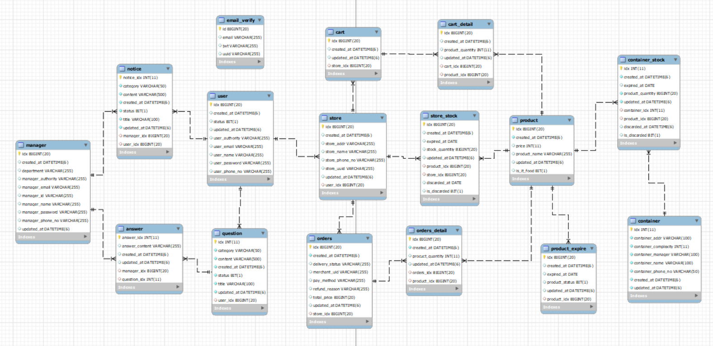
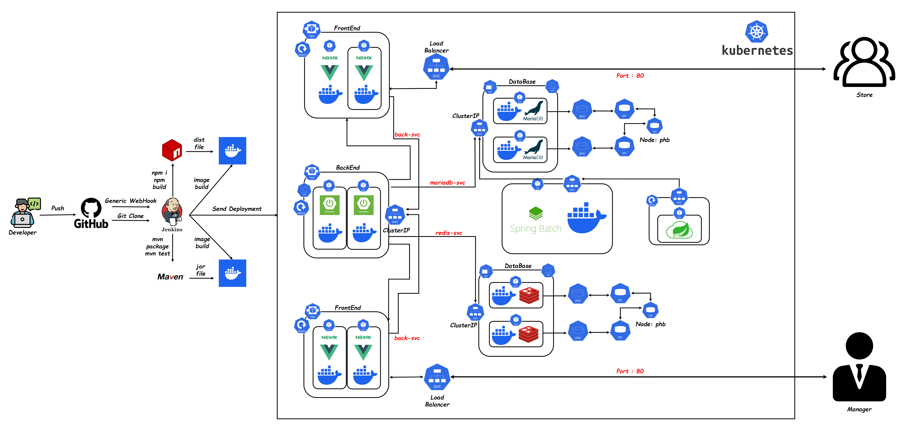

 

> **[플레이 데이터] 한화시스템 BEYOND SW캠프 / Team : Surisuri_Masuri**

 

### 🛠 Tech Stacks

---

#### &nbsp;　Frontend

&nbsp;&nbsp;&nbsp;&nbsp;
&nbsp;&nbsp;&nbsp;&nbsp;
&nbsp;&nbsp;&nbsp;&nbsp;
&nbsp;&nbsp;&nbsp;&nbsp;
&nbsp;&nbsp;&nbsp;&nbsp;</a>
&nbsp;&nbsp;&nbsp;&nbsp;</a>

#### &nbsp;　Backend

&nbsp;&nbsp;&nbsp;
&nbsp;&nbsp;&nbsp;
&nbsp;&nbsp;&nbsp;
&nbsp;&nbsp;&nbsp;
&nbsp;&nbsp;&nbsp;
&nbsp;&nbsp;&nbsp;

#### &nbsp;　DB

&nbsp;&nbsp;&nbsp;
&nbsp;&nbsp;&nbsp;

#### &nbsp;　CI/CD

&nbsp;&nbsp;&nbsp;&nbsp;</a>
&nbsp;&nbsp;&nbsp;&nbsp;</a>
&nbsp;&nbsp;&nbsp;&nbsp;
&nbsp;&nbsp;&nbsp;&nbsp;</a>
&nbsp;&nbsp;&nbsp;&nbsp;</a>
&nbsp;&nbsp;&nbsp;&nbsp;</a>
&nbsp;&nbsp;&nbsp;&nbsp;</a>
&nbsp;&nbsp;&nbsp;&nbsp;</a>
&nbsp;&nbsp;&nbsp;&nbsp;</a>
&nbsp;&nbsp;&nbsp;&nbsp;
&nbsp;&nbsp;&nbsp;&nbsp;

#### &nbsp;　Tools

&nbsp;&nbsp;&nbsp;&nbsp;
&nbsp;&nbsp;&nbsp;&nbsp;
&nbsp;&nbsp;&nbsp;&nbsp;

---

 

### 💻 팀원 소개
---

<table>
<tr>
<td align="center"><a href="https://github.com/your-github-hyeongyun"> <b>김현균</b></a></td>
<td align="center"><a href="https://github.com/your-github-hyeonbeom"> <b>박현범</b></a></td>
<td align="center"><a href="https://github.com/your-github-wonjun"> <b>정원준</b></a></td>
<td align="center"><a href="https://github.com/your-github-kyunghoon"> <b>한경훈</b></a></td>
</tr>
</table>

---

 

### ✨ 프로젝트 기본 소개

---

- 본 프로젝트는 커피 프랜차이즈 기업의 공급망 관리를 위한 주문 관리 시스템을 개선하고자 한다.

- 기존 시스템의 한계를 극복하고, 비즈니스 운영 효율을 극대화하기 위해 자동화 및 모니터링 기능을 강화하고자 한다.

 

### ✨ 프로젝트 목표

---

- 접근성 향상: 대시보드 형태의 웹을 개발하여 가맹점들이 편리하게 주문할 수 있도록 한다.   또한, 사용자 인터페이스를 최적화하여 주문 프로세스를 간편화한다.

- 부서 간 업무 처리 효율화: 본사 시스템의 접근 권한을 필요로 하는 부서의 직원들에게 적절한 권한을 부여하여 업무 처리 효율성을 향상시킨다.   또한, 시스템 내부의 커뮤니케이션 및 협업 기능을 강화하여 업무 처리 프로세스를 원활하게 한다.

- 실시간 재고 확인 및 배송 상태 확인 기능 추가: 상품의 재고와 배송 상태를 확인할 수 있는 기능을 시스템에 추가하여 가맹점과 본사 간의 투명성을 높힌다.   대시보드를 통해 사용자들이 쉽게 상품의 재고와 배송 상태를 확인할 수 있도록 한다.

- 유통기간 관리 기능 추가: 유통기한이 지나거나 유통기한이 임박한 상품에 대한 경고 및 알림 기능을 구현하여, 유통기간 관리를 효과적으로 지원한다.   이를 통해 상품의 품질을 유지하고 재고 관리를 최적화한다.

 

### 📌  프로젝트 기획

---

### 🔗 [WBS 바로가기](https://docs.google.com/spreadsheets/d/1VS6h_UvXCQAMcixQ1COoRRyjtkPPxUBTzK4tpFutFXQ/edit#gid=420001454)

### ✍ [요구사항 정의서 바로가기](https://docs.google.com/spreadsheets/d/1mO0hrGlxiyJS6M7duXKe6gTWfpthLB1u7dr9gcEcNyw/edit#gid=1526384192)

---
 

### 📜 프로젝트 설계

---

ERD

 

 

 

Relation Schema

 

 

### 🔗 [화면설계도 (Figma) 바로가기](https://www.figma.com/file/gibflCmudNsrlpFDWKvJxJ/Giga-Coffee?type=design&node-id=0-1&mode=design&t=EAiTX7alUngoUoYI-0)

### 🔗 [API 명세서 바로가기](https://www.notion.so/API-3680b3a4d3b641108f2686515dfc2222)

---

 

### ⚙️ 시스템 아키텍처

---

자세히 보기

 

 

    상세설명 작성
    

---
 

### 🌐 프론트엔드 서버

---

- Vue가 배포되어 있는 Nginx 서버로 클라이언트/관리자가 HTTP 요청을 보낸다.

- 클라이언트/관리자가 보낸 요청은 Nginx 서버에 도착한 후, 리버스 프록시 설정을 통해 백엔드 서버로 프록시 되어 전달된다.

- 백엔드에서 요청에 대한 응답으로 받은 데이터를 요청한 클라이언트/관리자에게 보내준다.

- 로그인, 회원가입 등을 제외한 서비스에 접근하기 위해서는 로그인하여 토큰을 발급 받아야 한다.

---
 

### 🏭 백엔드 서버

---

- 모놀리식 아키텍처 중 레이어드 아키텍처를 적용한 Spring Boot로 개발했다.

- Spring Security를 이용하여 JWT 토큰을 발급받은 사용자만 서비스를 이용할 수 있다.(회원가입, 로그인 등 제외)

- JPA를 사용하여 DB 서버에 접근하여 데이터 관련 요청을 처리했고, 조회 요청은 N+1 문제를 해결하기 위해 QueryDSL을 사용했다.

- 주문 결제 처리를 위해 포트원(PortOne)의 Api를 사용했다.

---
 

### 🛢 DB 서버(MariaDB)

---

    

MariaDB

  
- 부하 분산을 위해 Master/Slave의 이중화로 DB를 구성했다.

- 쓰기 요청은 Master에 전달하고, 읽기 요청은 Slave에 전달한다.
  

 
 

    

Redis

- 회원의 이메일 인증을 위한 UUID와 Access Token 및 Refresh Token을 관리한다.

- 부하 분산을 위해 Master/Slave의 이중화로 DB를 구성했다.

 

---
 

### 🚀 CI/CD 적용 후 시스템 아키텍처

---

CI/CD Images

 

 
 
    
#### CI/CD

---

- 개발자가 Source Code를 Github에 Push한다.

- Push 이후, Github의 Jenkins에서 Webhook을 전달한다.

- Jenkins에서 Github의 Source Code를 Clone하고 오류를 체크한다.

- 테스트 코드를 실행하여 성공하면 젠킨스 파이프라인의 다음 스테이지로 넘어가고, 실패하면 실행을 멈춘다.

- 테스트 코드를 성공하면 Source Code를 Build 하고, DockerHub에 Push한다.

- K8S Server의 Manifest File의 Version을 갱신하고 적용하여 배포한다.

---
 

###  🌞 Monitoring System

---

Grafana & Prometheus

 

 
 

---

 

### 💥 위키(Wiki)

---

### 🔗 [위키 바로가기](https://github.com/beyond-sw-camp/be02-fin-Surisuri_Masuri-OMS/wiki)

