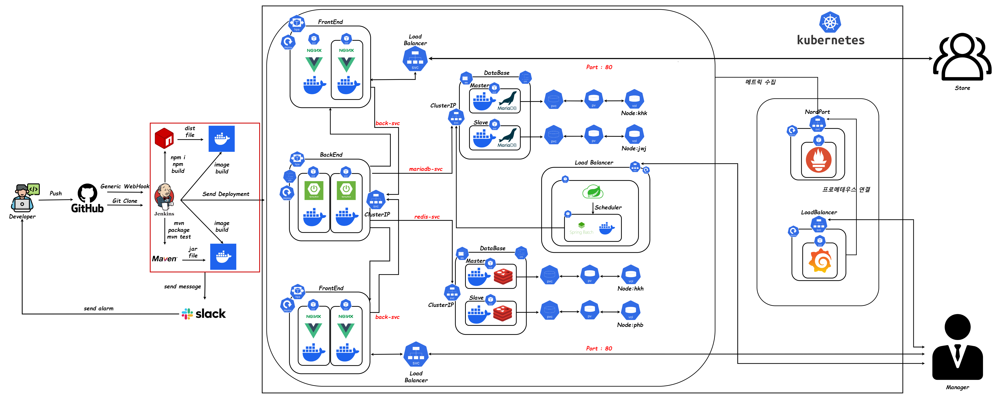
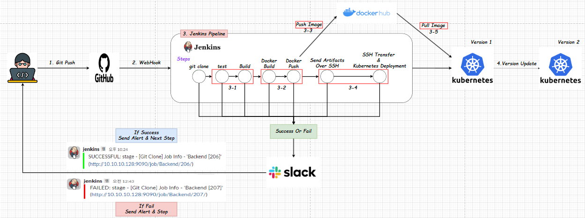
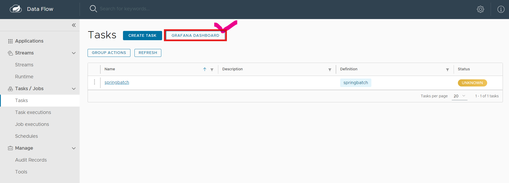
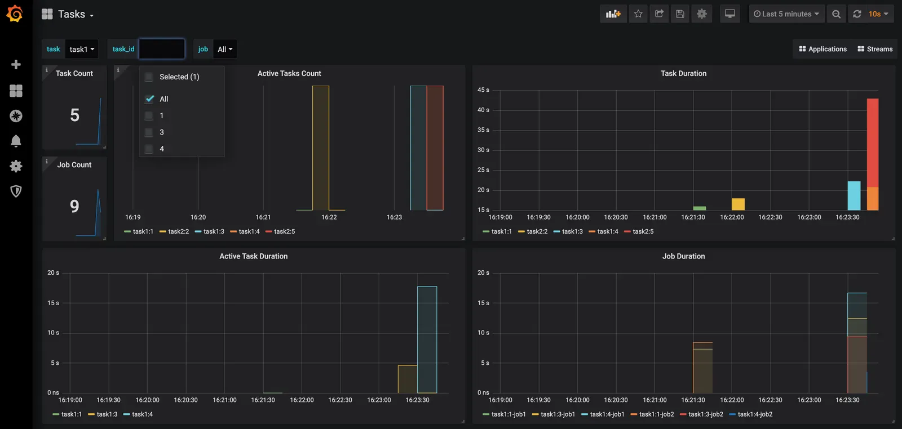

 

> **[플레이 데이터] 한화시스템 BEYOND SW캠프 / Team : Surisuri_Masuri**

 

### 🛠 Tech Stacks

---

#### &nbsp;　Frontend

&nbsp;&nbsp;&nbsp;&nbsp;
&nbsp;&nbsp;&nbsp;&nbsp;
&nbsp;&nbsp;&nbsp;&nbsp;
&nbsp;&nbsp;&nbsp;&nbsp;
&nbsp;&nbsp;&nbsp;&nbsp;</a>
&nbsp;&nbsp;&nbsp;&nbsp;</a>
&nbsp;&nbsp;&nbsp;&nbsp;</a>

#### &nbsp;　Backend

&nbsp;&nbsp;&nbsp;
&nbsp;&nbsp;&nbsp;
&nbsp;&nbsp;&nbsp;
&nbsp;&nbsp;&nbsp;
&nbsp;&nbsp;&nbsp;
&nbsp;&nbsp;&nbsp;
&nbsp;&nbsp;&nbsp;
&nbsp;&nbsp;&nbsp;
&nbsp;&nbsp;&nbsp;
&nbsp;&nbsp;&nbsp;

#### &nbsp;　DB

&nbsp;&nbsp;&nbsp;
&nbsp;&nbsp;&nbsp;

#### &nbsp;　CI/CD

&nbsp;&nbsp;&nbsp;&nbsp;</a>
&nbsp;&nbsp;&nbsp;&nbsp;</a>
&nbsp;&nbsp;&nbsp;&nbsp;
&nbsp;&nbsp;&nbsp;&nbsp;</a>
&nbsp;&nbsp;&nbsp;&nbsp;</a>
&nbsp;&nbsp;&nbsp;&nbsp;</a>
&nbsp;&nbsp;&nbsp;&nbsp;</a>
&nbsp;&nbsp;&nbsp;&nbsp;</a>
&nbsp;&nbsp;&nbsp;&nbsp;</a>
&nbsp;&nbsp;&nbsp;&nbsp;
&nbsp;&nbsp;&nbsp;&nbsp;

#### &nbsp;　Tools

&nbsp;&nbsp;&nbsp;&nbsp;
&nbsp;&nbsp;&nbsp;&nbsp;
&nbsp;&nbsp;&nbsp;&nbsp;

---

 

### 💻 팀원 소개

---

<table>
<tr>
<td align="center"><a href="https://github.com/Hyeon-kyun"> <b>김현균</b></a></td>
<td align="center"><a href="https://github.com/ParkHyeonBeom"> <b>박현범</b></a></td>
<td align="center"><a href="https://github.com/wonjunmar"> <b>정원준</b></a></td>
<td align="center"><a href="https://github.com/kyungqq"> <b>한경훈</b></a></td>
</tr>
</table>

---

 

### ✨ 프로젝트 기본 소개

---

- 커피 프랜차이즈 산업은 고객들의 수요 증가와 함께 급속히 성장하고 있습니다. 그 결과로 공급망 관리가 더욱 중요해지고 있으며, 주문 처리 및 재고 관리 등의 프로세스가 효율적으로 관리되어야 합니다.
  이에 따라 비즈니스 운영의 효율성을 높이기 위해 더 나은 시스템을 구축하고자 합니다.

- 이번 프로젝트는 주문 관리 시스템을 개선하여 자동화 및 모니터링 기능을 강화함으로써 공급망을 최적화하고, 배송 요청에 따른 재고 수정과 더불어 정확한 재고 정보 제공을 통해 고객 서비스 품질을 향상시키는 것이 이번 프로젝트의 목표입니다.

 

### ✨ 프로젝트 목표

---

1. &nbsp; 본사 재고 관리
- 본사의 창고 내 제품들의 유통기한이 임박한 경우, 자동으로 폐기 처리하는 시스템을 도입하여 유통기한 관리를 자동화하는 시스템을 구현했습니다.

2. &nbsp; 가맹점  재고 관리
- 가맹점의 창고 내 제품들의 유통기한이 임박한 경우, 자동으로 폐기 처리하고 해당 상품 정보를 알림으로 받을 수 있는 시스템을 구현했습니다.

3. &nbsp; 배송 상태에 따른 재고 변경 
- 주문한 상품이 배송 상태에 따라 창고 또는 가맹점의 재고를 변경시키는 시스템을 구현했습니다.

 

### 📌  프로젝트 기획

---

### 🔗 [WBS 바로가기](https://docs.google.com/spreadsheets/d/1VS6h_UvXCQAMcixQ1COoRRyjtkPPxUBTzK4tpFutFXQ/edit#gid=420001454)

### ✍ [요구사항 정의서 바로가기](https://docs.google.com/spreadsheets/d/1mO0hrGlxiyJS6M7duXKe6gTWfpthLB1u7dr9gcEcNyw/edit#gid=1526384192)

---
 

### 📜 프로젝트 설계

---

ERD

 

 

 

Relation Schema

 

 

### 🔗 [화면설계도 (Figma) 바로가기](https://www.figma.com/file/gibflCmudNsrlpFDWKvJxJ/Giga-Coffee?type=design&node-id=0-1&mode=design&t=EAiTX7alUngoUoYI-0)

### 🔗 [API 명세서 바로가기](https://www.notion.so/API-3680b3a4d3b641108f2686515dfc2222)

---

 

###  🌎 홈페이지 링크

---

### 🔗 [가맹점 홈페이지 바로가기](http://www.hyeonbeom.kro.kr)

### 🔗 [본사 홈페이지 바로가기](http://www.hyeonbeom2.kro.kr)

---

 

### ⚙️ 시스템 아키텍처

---

자세히 보기

 

 
    

---
 

### 🌐 프론트엔드 서버

---

- Vue가 배포되어 있는 Nginx 서버로 클라이언트/관리자가 HTTP 요청을 보낸다.

- 클라이언트/관리자가 보낸 요청은 Nginx 서버에 도착한 후, 리버스 프록시 설정을 통해 백엔드 서버로 프록시 되어 전달된다.

- 백엔드에서 요청에 대한 응답으로 받은 데이터를 요청한 클라이언트/관리자에게 보내준다.

- 로그인, 회원가입 등을 제외한 서비스에 접근하기 위해서는 로그인하여 토큰을 발급 받아야 한다.

---
 

### 🏭 백엔드 서버

---

- 모놀리식 아키텍처 중 레이어드 아키텍처를 적용한 Spring Boot로 개발했다.

- Spring Security를 이용하여 JWT 토큰을 발급받은 사용자만 서비스를 이용할 수 있다.(회원가입, 로그인 등 제외)

- JPA를 사용하여 DB 서버에 접근하여 데이터 관련 요청을 처리했고, 조회 요청은 N+1 문제를 해결하기 위해 QueryDSL을 사용했다.

- 주문 결제 처리를 위해 포트원(PortOne)의 Api를 사용했다.

---
 

### 🛢 DB 서버

---

    

MariaDB

  
- 부하 분산을 위해 Master/Slave의 이중화로 DB를 구성했습니다.

- 쓰기 요청은 Master에 전달되고, 읽기 요청은 Slave에 전달됩니다.
  

 
 

    

Redis

- 회원의 이메일 인증을 위한 UUID와 Access Token 및 Refresh Token을 관리합니다.

- 부하 분산을 위해 Master/Slave의 이중화로 DB를 구성했습니다.

 

---
 

### 🚀 CI/CD

---

Jenkins PipeLine

 

 
 

    
 

CI/CD Video

 

 
 

    

---
 

###  🌞 Monitoring System

---

Grafana

 

 

- 배치 처리 이후 해당 작업의 메트릭을 모니터링하기 위해 그라파나를 사용한다.

 

---

 

### 💥 위키(Wiki)

---

### 🔗 [위키 바로가기](https://github.com/beyond-sw-camp/be02-fin-Surisuri_Masuri-OMS/wiki)

