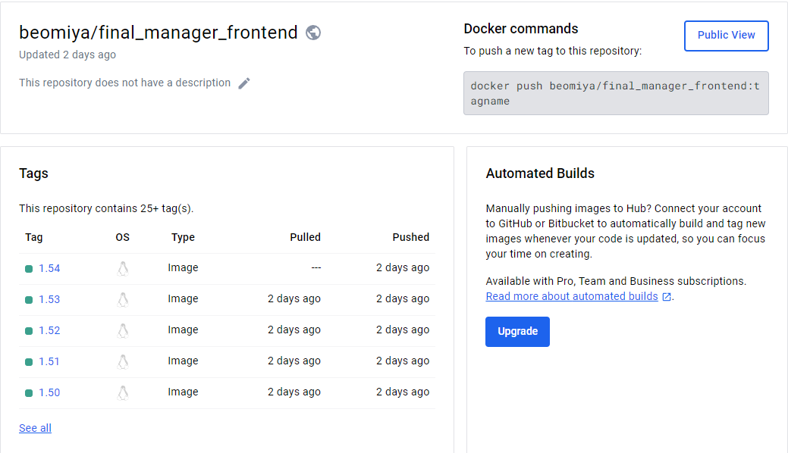
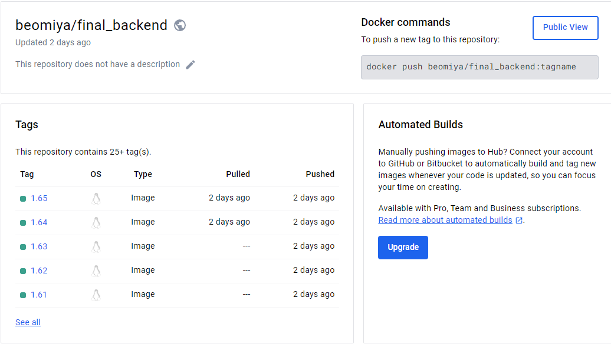

 

> <h2 style="color:black; font-family: 'Nanum Pen Script', cursive;">[플레이 데이터] 한화시스템 BEYOND SW캠프 / Team : SuriSuri_Masuri</h3>

 
 

### 🛠️ Tech Stacks

---

    
    
     
    
    
    
     
    
    
     
    

 
 

### 💻 Architecture

---
### System Architecture

### Cluster Architecture

 
 

### ⚙️ 운영환경

---

DockerHub Images

<h3><a href="https://hub.docker.com/repository/docker/beomiya/final_store_frontend/general">FrontEnd - Store</a></h3>

 

<h3><a href="https://hub.docker.com/repository/docker/beomiya/final_manager_frontend/general">FrontEnd - Manager</a></h3>

 

<h3><a href="https://hub.docker.com/repository/docker/beomiya/final_backend/general">BackEnd</a></h3>

 

 
 

Kubernetes

 
 

Jenkins

 
 

### 🐳 CI/CD의 필요성

---

CI: 지속적 통합

CI(Continuous Integration)는 개발자들이 코드를 변경할 때마다 자동으로 빌드되어 통합되는 프로세스를 의미한다.  이를 통해 여러 명의 개발자가 동시에 작업할 때 발생할 수 있는 통합 오류를 미리 발견하고 해결할 수 있다.

### 주요 특징:
- 코드 변경 시 자동으로 빌드 및 테스트
- 빌드 실패 시 즉시 알림
- 지속적인 통합으로 품질 향상 및 빠른 배포 가능

 
 

CD: 지속적 배포

CD(Continuous Deployment/Delivery)는 CI에서 빌드된 소프트웨어를 자동으로 테스트, 패키징하여 프로덕션 환경에 자동으로 배포하는 프로세스를 의미한다. 이는 GitHub의 원격 저장소에 코드를 push할 때마다 자동으로 빌드 및 배포되어 사용자에게 신속한 업데이트를 제공한다.

### 주요 특징:
- 자동화된 배포 프로세스
- 사용자 피드백에 따른 지속적인 개선
- 빠르고 신속한 업데이트 제공으로 사용자 만족도 향상

 
 

### ✍️ CI/CD 시나리오

---

FrontEnd

GitHub 저장소에 최신 코드를 Push한다.

GitHub 저장소는 WebHook을 사용하여 Jenkins에 최신 코드 Push 이벤트를 전달한다.

Jenkins 파이프라인은 다음과 같은 절차에 따라 작동한다

1. Jenkins 서버는 연결된 GitHub 저장소에서 최신 코드를 복제한다.
2. FrontEnd 프로젝트의 경우 npm i 명령어를 사용하여 필요한 종속성을 설치한다.
3. npm run build 명령어를 사용하여 프로젝트를 빌드한다.
4. 빌드된 dist 파일을 Dockerfile에 따라 Docker 이미지를 생성한다.
5. 생성된 Docker 이미지를 Docker Hub에 업로드하기 위해 로그인한다.
6. Jenkins 서버는 등록된 K8S 마스터 노드에 배포에 사용할 Deployment.yml 파일을 전송한다.
7. K8S 마스터는 전송된 Deployment.yml 파일을 kubectl apply 명령어를 사용하여 적용한다.
8. Jenkins 서버는 작성된 파이프라인의 각 단계별 실행 결과를 Slack에 전송한다.

또한, 배포 방식은 Rolling Update를 사용하여 이전 버전과 새 버전의 파드를 점진적으로 교체하여 가용성을 유지한다.

 

 
 

BackEnd

GitHub 저장소에 최신 코드를 Push한다.

GitHub 저장소는 WebHook을 사용하여 Jenkins에 최신 코드 Push 이벤트를 전달한다.

Jenkins 파이프라인은 다음과 같은 절차에 따라 작동한다

1. Jenkins 서버는 연결된 GitHub 저장소에서 최신 코드를 복제한다.
2. BackEnd 프로젝트의 경우 mvn test 명령어를 사용하여 테스트를 실행하여 코드의 품질을 확인한다.
3. 이후 테스트가 통과되면 mvn package 명령어를 실행하여 아티팩트를 생성한다.
4. 빌드된 jar 파일을 Dockerfile에 따라 Docker 이미지를 생성한다.
5. 생성된 Docker 이미지를 Docker Hub에 업로드하기 위해 로그인한다.
6. Jenkins 서버는 등록된 K8S 마스터 노드에 배포에 사용할 Deployment.yml 파일을 전송한다.
7. K8S 마스터는 전송된 Deployment.yml 파일을 kubectl apply 명령어를 사용하여 적용한다.
8. Jenkins 서버는 작성된 파이프라인의 각 단계별 실행 결과를 Slack에 전송한다.

또한, 배포 방식은 Rolling Update를 사용하여 이전 버전과 새 버전의 파드를 점진적으로 교체하여 가용성을 유지한다.

 
 

### 🎥 CI/CD 시연 영상

---

FrontEnd

 
 

BackEnd

