 

> <h2 style="color:black; font-family: 'Nanum Pen Script', cursive;">[플레이 데이터] 한화시스템 BEYOND SW캠프 / Team : SuriSuri_Masuri</h3>

 
 

### 🛠️ Tech Stacks

---

    
    
     
    
    
    
     
    
    
     
    

 
 

### 💻 Architecture

---

### System Architecture

### Cluster Architecture

 
 

### ⚙️ 운영환경

---

DockerHub Images

<h3><a href="https://hub.docker.com/repository/docker/beomiya/final_store_frontend/general">FrontEnd - Store</a></h3>

 

<h3><a href="https://hub.docker.com/repository/docker/beomiya/final_manager_frontend/general">FrontEnd - Manager</a></h3>

 

<h3><a href="https://hub.docker.com/repository/docker/beomiya/final_backend/general">BackEnd</a></h3>

 

 
 

Kubernetes

<h3>크론잡</h3>

 
<h3>디플로이먼트</h3>
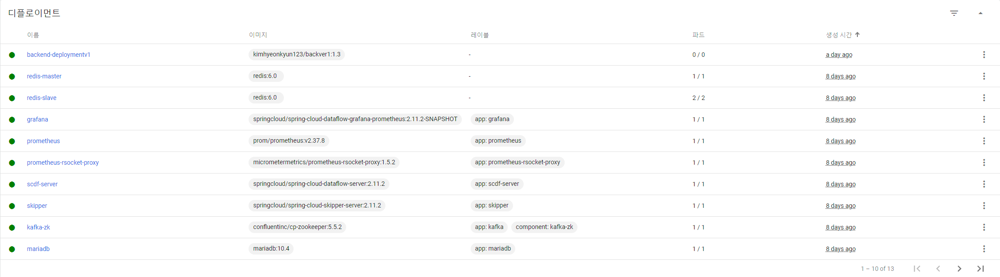
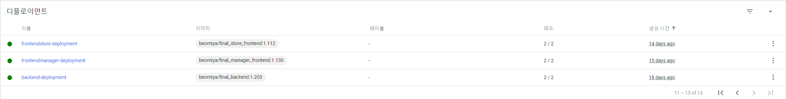   
 
<h3>파드</h3>
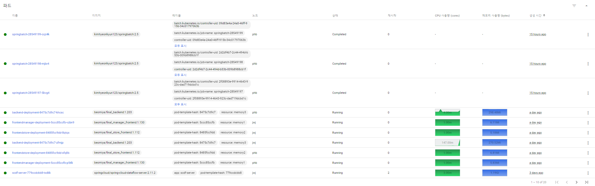
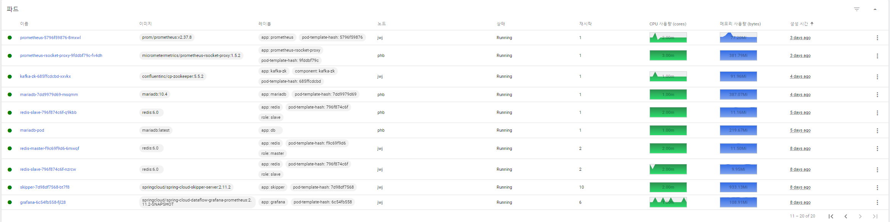
 
<h3>레플리카 셋</h3>
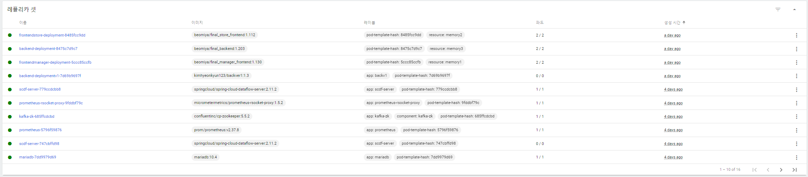
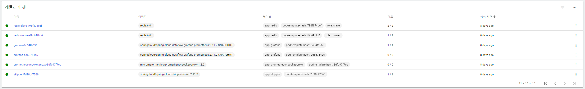
 
<h3>서비스</h3>
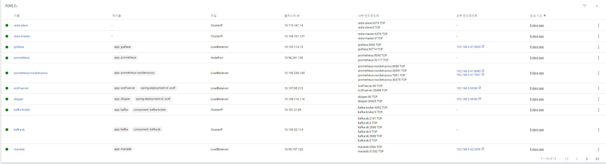
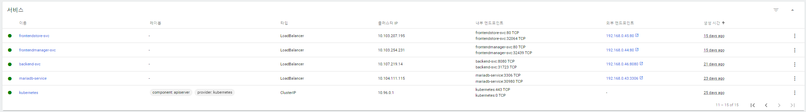    
     
<h3>컨피그 맵</h3>
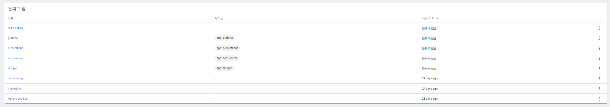
 
<h3>퍼시스턴스 볼륨 클레임</h3>

 
<h3>퍼시스턴스 볼륨</h3>

 

 
 

Jenkins

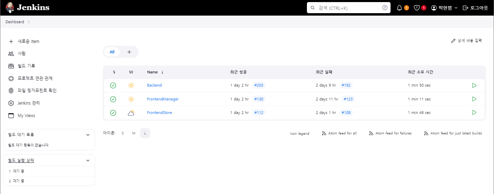

 
 

### ✍️ CI/CD 시나리오

---

FrontEnd

 
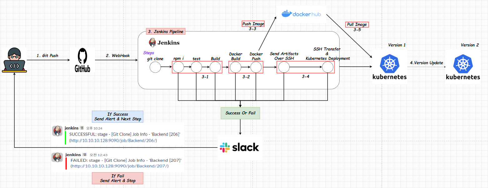
GitHub 저장소에 최신 코드를 Push한다.

GitHub 저장소는 Generic WebHook을 사용하여 Jenkins Server에 Pull Request Event를 전달한다.

Jenkins FrontEnd PipeLine은 다음과 같은 절차에 따라 작동한다

1. Jenkins 서버는 연결된 GitHub 저장소에서 최신 코드를 Clone 한다.
2. FrontEnd 프로젝트의 경우 npm i 명령어를 사용하여 필요한 종속성을 설치한다.
3. npm test 명령어를 사용하여 작성된 테스트 코드를 실행한다.
4. npm run build 명령어를 사용하여 프로젝트를 빌드한다.
5. 빌드된 dist 파일을 Dockerfile에 따라 Docker 이미지를 생성한다.
6. 생성된 Docker 이미지를 Docker Hub에 로그인 후 push한다.
7. Jenkins 서버는 등록된 K8S 마스터 노드에 배포에 사용될 Deployment.yml 파일을 전송한다.
8. K8S 마스터는 전송된 Deployment.yml 파일을 kubectl apply 명령어를 사용하여 적용한다.

배포 방식은 Rolling Update를 사용하여 이전 버전과 새 버전의 파드를 점진적으로 교체하여 가용성을 유지한다.
또한, 진행 중에 오류가 발생하면 해당 단계에서 배포가 중단되고 Slack으로 오류 알림이 전송된다. 성공적으로 완료되면 Slack으로 성공 알림이 전송되며 지정된 작업은 중단되지 않고 계속된다.

 

 
 

BackEnd

 
GitHub 저장소에 최신 코드를 Push한다.

GitHub 저장소는 Generic WebHook을 사용하여 Jenkins Server에 Pull Request Event를 전달한다.

Jenkins BackEnd PipeLine은 다음과 같은 절차에 따라 작동한다

1. Jenkins 서버는 연결된 GitHub 저장소에서 최신 코드를 Clone 한다.
2. Backend 프로젝트의 경우 npm test 명령어를 사용하여 작성된 테스트 코드를 실행한다.
4. npm run build 명령어를 사용하여 프로젝트를 빌드한다.
5. 빌드된 dist 파일을 Dockerfile에 따라 Docker 이미지를 생성한다.
6. 생성된 Docker 이미지를 Docker Hub에 로그인 후 push한다.
7. Jenkins 서버는 등록된 K8S 마스터 노드에 배포에 사용될 Deployment.yml 파일을 전송한다.
8. K8S 마스터는 전송된 Deployment.yml 파일을 kubectl apply 명령어를 사용하여 적용한다.

배포 방식은 Rolling Update를 사용하여 이전 버전과 새 버전의 파드를 점진적으로 교체하여 가용성을 유지한다.
또한, 진행 중에 오류가 발생하면 해당 단계에서 배포가 중단되고 Slack으로 오류 알림이 전송된다. 성공적으로 완료되면 Slack으로 성공 알림이 전송되며 지정된 작업은 중단되지 않고 계속된다.

 
 

### 🎥 CI/CD 시연 영상

---

Sample

    

 

